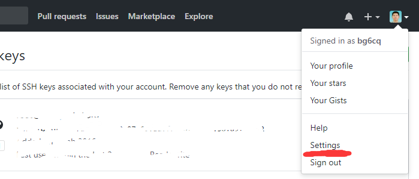

## 大家一起学Git 第二课 环境配置

1. 设置自己的名字和邮件地址

在Linux中执行以下命令设置自己的信息，请用自己的信息替换如下内容：
````
git config --global user.name "Zhang Huanjie"
git config --global user.email james@ustc.edu.cn

````

2. 生成ssh-key

ssh-key是git客户端与github认证最方便的方式。

首先查看自己的账户是否已经生成过ssh-key，执行命令
````
james@linux ~]$ ls -al ~/.ssh
drwx------  2 james users 4096 Nov 27  2015 .
drwxr-xr-x 27 james users 4096 Oct 16 23:06 ..
-rw-------  1 james users 1675 Nov 22  2015 id_rsa
-rw-r--r--  1 james users  405 Nov 22  2015 id_rsa.pub
````
如果自己的home目录.ssh目录下存在id_rsa和id_rsa.pub，说明ssh-key已经存在，可以跳过这一步。

否则执行
```
ssh-keygen
```
生成ssh-key，其中的`id_rsa`是自己的私钥，请妥善保存；`id_ras.pub`是自己的公钥，别人拿到也无所谓，可以随意公布。
上面的文件id_rsa.pub内容(很长的一行)是
```
[james@linux ~]$ cat ~/.ssh/id_rsa.pub
ssh-rsa AAAAB3NzaC1yc2EAAAABIwAAAQEAr9X0n+zQ0zS7A9JLV8611I4w4B13MEbdmDkGf6OyL4f0LVLPY2f7yZpi8VqgyqwUasGtMYRcyE/A7vln+pNEwASPviluhfGr7coxE9ZisdxXTkex9oqhqPfmhnlBjLtsTg3Yh4ZLmzgYprQgAacT9Fc1hNnrc5vwh5lMh7i+bfVkIXbKY8k2dc39qBbsVxtmLDd1rLpb4i+laajglrBvHWFrWdMiOp4Y/O948hSuShDhpthvkV+ZYOlh9QsRD2rXNqfTMC0QXYeYI3tNUMdGxdqgdMC7ZwpH69e5l9WhnMEK1N8io5lITwEhSyoouRmJGuaYaF8MY6BHicuBu9FJEw== james@linux.ustc.edu.cn
````

3. 登录GitHub

浏览器访问 [https://github.com](https://github.com), 单击Sing in, 输入自己账号，
密码，登录Github。如果已经登录，请忽略这一步。

4. 将自己的公钥加到github账号中

单击最右上角的图标，弹出的下来框中，单击"Settings"，如下图所示：


单击左侧的"SSH and PGP keys"，单击右上角的"New SSH key"或者直接拉到最下，如下图所示：


在Key窗口中粘贴上面的id_rsa.pub内容，注意文本是一行，中间不能有换行，然后单击"Add SSH key"，如下图所示：


## 课程完成检查点
1. 配置了自己的姓名和邮箱
执行`git config --global -l`可以看到，如下:
````
[james@linux ~]$ git config --global -l
user.name=Zhang Huanjie
user.email=james@ustc.edu.cn
````

2. Linux服务器上有自己账户的ssh-key

执行以下命令，可以看到key文件
````
ls ~/.ssh
````

3. github账号中添加了自己的公钥
   
浏览器访问 [https://github.com](https://github.com)，单击Sign in, 输入自己账号，密码，登录后在有上角图标下来菜单Settings/SSH and GPG keys可以看到自己的公钥。

