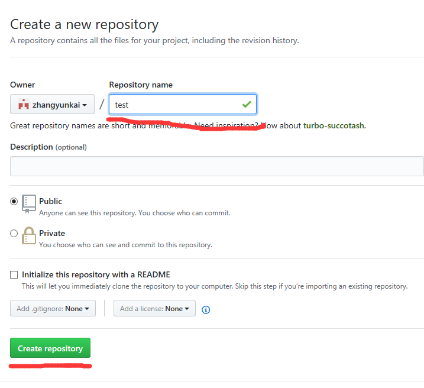
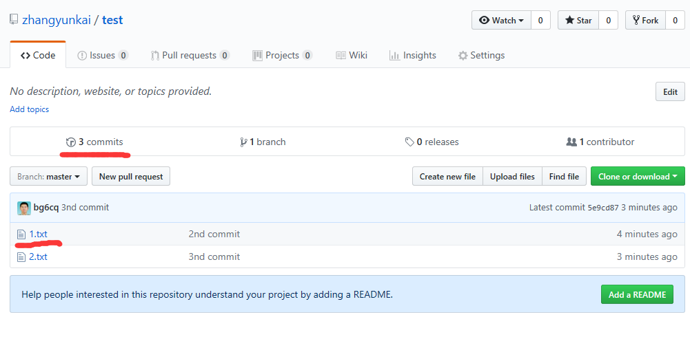

## 大家一起学Git 第三课 新建项目，跟踪自己的修改

注：以下测试使用的账号是zhangyunkai，请用自己的账号替换。

1. 登录GitHub

浏览器访问 [https://github.com](https://github.com), 单击Sing in, 输入自己账号，
密码，登录Github。如果已经登录，请忽略这一步。

2. 新建一个项目

单击右上角+图标，弹出的下拉框中，单击"New repository"，如下图所示：


输入项目名字，单击如下图所示：


完成项目创建。

3. 把Linux上的某些文件加入版本管理跟踪

假定Linux上test目录（这里是新建的目录）下是要跟踪的文件。

以下的命令，新建了2个测试文件1.txt，2.txt，并把文件提交给服务器。
````
[james@linux ~]$ mkdir test
[james@linux ~]$ cd test
[james@linux test]$ git init
Initialized empty Git repository in /home/users/james/test/.git/
[james@linux test]$ echo "this is file 1" > 1.txt
[james@linux test]$ echo "this is file 2" > 2.txt
[james@linux test]$ git add 1.txt 2.txt
[james@linux test]$ git commit -m "this is first commit"
[master (root-commit) 944e15d] this is first commit
 2 files changed, 2 insertions(+)
 create mode 100644 1.txt
 create mode 100644 2.txt
[james@linux test]$ git remote add origin git@github.com:zhangyunkai/test.git
[james@linux test]$ git push -u origin master
The authenticity of host 'github.com (192.30.255.112)' can't be established.
RSA key fingerprint is 16:27:ac:a5:76:28:2d:36:63:1b:56:4d:eb:df:a6:48.
Are you sure you want to continue connecting (yes/no)? yes
Warning: Permanently added 'github.com,192.30.255.112' (RSA) to the list of known hosts.
Counting objects: 4, done.
Delta compression using up to 8 threads.
Compressing objects: 100% (2/2), done.
Writing objects: 100% (4/4), 277 bytes, done.
Total 4 (delta 0), reused 0 (delta 0)
To git@github.com:zhangyunkai/test.git
 * [new branch]      master -> master
````
这时登录https://github.com/zhangyunkai/test 能看到2个文件。

4. 修改文件并提交变化

执行以下命令，在文件中增加内容，并提交修改：
````
[james@linux test]$ echo "test line 2 of file 1" >> 1.txt
[james@linux test]$ echo "second line of file 2" >> 2.txt
[james@linux test]$ git add 1.txt 2.txt
[james@linux test]$ git commit -m "2nd commit"
[master 532b002] 2nd commit
 2 files changed, 2 insertions(+)
[james@linux test]$ git push
Counting objects: 7, done.
Delta compression using up to 8 threads.
Compressing objects: 100% (2/2), done.
Writing objects: 100% (4/4), 334 bytes, done.
Total 4 (delta 0), reused 0 (delta 0)
To git@github.com:zhangyunkai/test.git
   944e15d..532b002  master -> master
````
这时登录https://github.com/zhangyunkai/test 能看到2个文件有变化。

5. 查看变化的历史

单击https://github.com/zhangyunkai/test 下图的位置，可以看到文件变化的历史：




## 课程完成检查点

1. 新建项目

2. 文件的修改可以提交到服务器
`
3. 服务器上可以看到修改的历史

