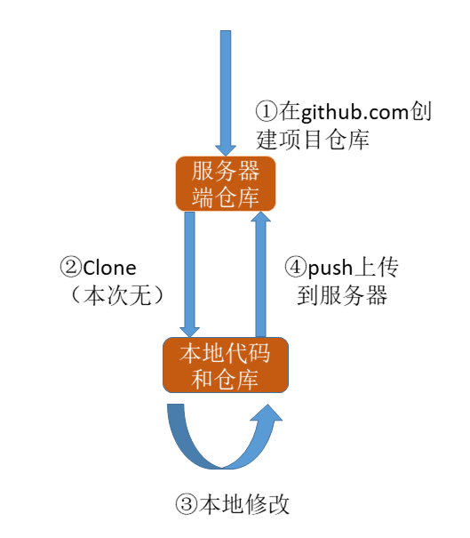
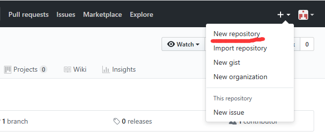
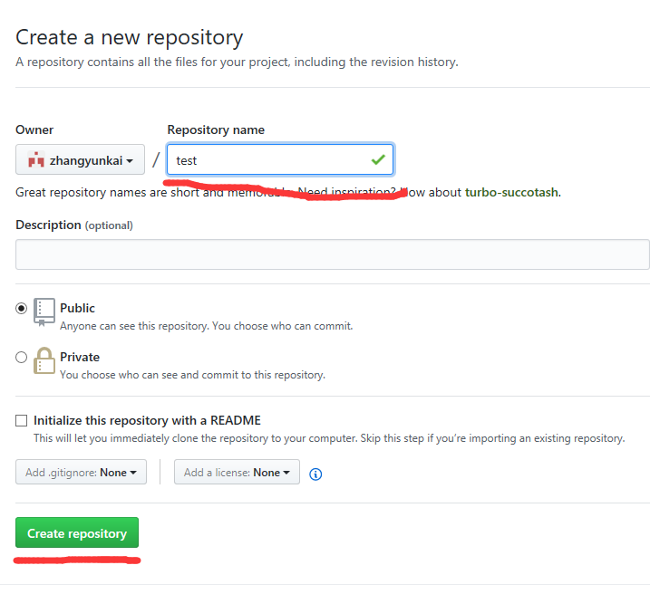
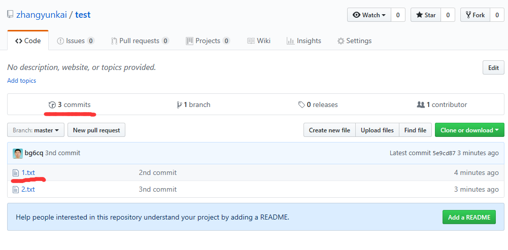
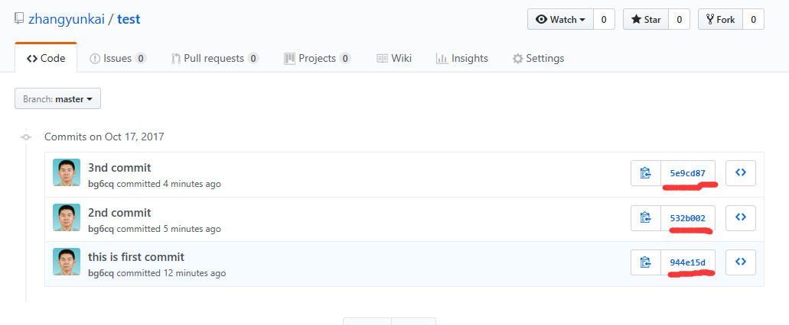
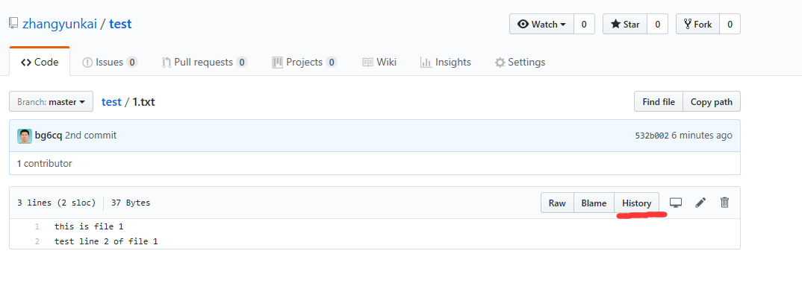

## 第三课 新建项目，跟踪自己的修改

> 📌 **提示**：以下示例中的 `YOUR_USERNAME` 请替换为你的 GitHub 用户名。



### 1. 登录 GitHub

访问 [https://github.com](https://github.com)，点击 "Sign in" 登录。

### 2. 新建一个项目

1. 点击右上角 **+** 图标
2. 选择 **New repository**
3. 填写信息：
   - **Repository name**：项目名（如 `test`）
   - **Description**：可选描述
   - **Public/Private**：选择 Public（公开）或 Private（私有）
   - 不要勾选 **Initialize this repository with a README**（可选）
4. 点击 **Create repository**




### 3. 在本地初始化 Git 仓库并提交

```bash
# 创建并进入测试目录
$ mkdir ~/test
$ cd ~/test

# 初始化 Git 仓库
$ git init
Initialized empty Git repository in /home/users/james/test/.git/

# 创建测试文件
$ echo "this is file 1" > 1.txt
$ echo "this is file 2" > 2.txt

# 添加文件到暂存区
$ git add 1.txt 2.txt
# 或添加所有文件：git add .

# 提交到本地仓库
$ git commit -m "this is first commit"
[master (root-commit) 944e15d] this is first commit
 2 files changed, 2 insertions(+)
 create mode 100644 1.txt
 create mode 100644 2.txt

# 关联远程仓库（替换 YOUR_USERNAME 为你的 GitHub 用户名）
$ git remote add origin git@github.com:YOUR_USERNAME/test.git

# 推送到 GitHub
$ git push -u origin master
The authenticity of host 'github.com (192.30.255.112)' can't be established.
RSA key fingerprint is SHA256:xxxxxxxxxxxxxxxxxxxxxxxx.
Are you sure you want to continue connecting (yes/no)? yes
Warning: Permanently added 'github.com' (RSA) to the list of known hosts.
Enumerating objects: 4, done.
Counting objects: 100% (4/4), done.
Delta compression using up to 8 threads.
Compressing objects: 100% (2/2), done.
Writing objects: 100% (4/4), 277 bytes, done.
Total 4 (delta 0), reused 0 (delta 0), pack-reused 0
To github.com:YOUR_USERNAME/test.git
 * [new branch]      master -> master
Branch 'master' set up to track remote branch 'master' from 'origin' by 'rebase'.
```

> 💡 **注意**：
> - 首次连接 GitHub 时会提示确认主机指纹，输入 `yes` 确认
> - 现在 GitHub 默认使用 `main` 作为主分支名，如遇到分支名问题可使用 `git branch -M main` 修改

### 4. 修改文件并提交

```bash
# 修改文件内容
$ echo "test line 2 of file 1" >> 1.txt
$ echo "second line of file 2" >> 2.txt

# 查看变化
$ git status
# On branch master
# Changes not staged for commit:
#   (use "git add <file>..." to update what will be committed)
#   (use "git restore <file>..." to discard changes in working directory)
#       modified:   1.txt
#       modified:   2.txt

# 添加修改到暂存区
$ git add 1.txt 2.txt

# 提交
$ git commit -m "2nd commit"
[master 532b002] 2nd commit
 2 files changed, 2 insertions(+)

# 推送（已关联远程，直接 git push 即可）
$ git push
Enumerating objects: 7, done.
Counting objects: 100% (7/7), done.
Delta compression using up to 8 threads.
Compressing objects: 100% (2/2), done.
Writing objects: 100% (4/4), 334 bytes | 334.00 KiB/s, done.
Total 4 (delta 0), reused 0 (delta 0), pack-reused 0
To github.com:YOUR_USERNAME/test.git
   944e15d..532b002  master -> master
```

此时访问 `https://github.com/YOUR_USERNAME/test` 可以看到文件变化。

### 5. 查看提交历史

在 GitHub 项目页面：

1. 点击文件列表上方的 commit 数量链接（如 "2 commits"）
2. 或点击任意文件后查看 **History** 标签





---

## ✅ 课程完成检查点

### 1. 新建项目
- [ ] 在 GitHub 上成功创建仓库

### 2. 文件修改可以提交到服务器
- [ ] 本地 `git add` 和 `git commit` 成功
- [ ] `git push` 成功推送到 GitHub

### 3. 服务器上可以看到修改历史
- [ ] 访问 GitHub 项目页面能看到提交记录

---

> 📌 **下一步**：完成 [第四课 Fork 与 Pull Request](../4/README.md)
