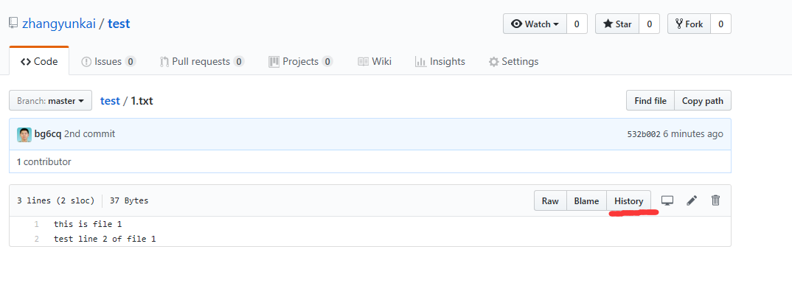

## 大家一起学Git 第四课 Fork一个项目，把自己的修改提交给服务器，并向上游发pull请求

注：以下测试使用的账号是zhangyunkai（XXXX），请用自己的账号替换。

1. 登录GitHub

浏览器访问 [https://github.com](https://github.com), 单击 "Sign in", 输入自己账号、
密码，登录Github。如果已经登录，请忽略这一步。

2. Fork一个项目

所谓Fork一个项目，可以理解为将别人的项目拷贝一份在自己的账户下，然后自己可以随意修改。

我增加了一个测试项目，希望大家添加参与“大家一起学Git”的人员信息，项目地址是 https://github.com/bg6cq/ilovegit 。

Fork这个项目的方式是，用浏览器打开 [https://github.com/bg6cq/ilovegit](https://github.com/bg6cq/ilovegit)，单击右侧的Fork即可，如下图所示：


Fork完成后，在自己的账号下就能看到这个项目了。

3. 在Linux中下载一份项目代码

执行以下命令，下载一份项目代码到目录ilovegit，注意这里的项目库地址是自己(zhangyunkai/XXXX)的，而不是bg6cq的。
````
cd ~
[james@linux ~]$ git clone git@github.com:XXXX/ilovegit.git
Cloning into 'ilovegit'...
remote: Counting objects: 3, done.
remote: Compressing objects: 100% (2/2), done.
remote: Total 3 (delta 0), reused 3 (delta 0), pack-reused 0
Receiving objects: 100% (3/3), done.
[james@linux ~]$ cd ilovegit/
[james@linux ilovegit]$ ls
README.md
[james@linux ilovegit]$ cat README.md
## git 学习宣言

我喜欢git，我是来自中国科大的张焕杰。
````

4. 修改文件并提交变化，这时提交到的是自己fork的那份库

执行以下命令，在文件中增加内容，并提交修改，建议使用vi编辑文件README.md：
````
[james@linux ilovegit]$ echo "我喜欢git，我是来自中国科大的测试用户。" >> README.md
[james@linux ilovegit]$ git add README.md
[james@linux ilovegit]$ git commit -m "test user"
[master b375ad9] test user
 1 file changed, 1 insertion(+)
[james@linux ilovegit]$ git push
Counting objects: 5, done.
Delta compression using up to 8 threads.
Compressing objects: 100% (2/2), done.
Writing objects: 100% (3/3), 338 bytes, done.
Total 3 (delta 0), reused 0 (delta 0)
To git@github.com:zhangyunkai/ilovegit.git
   ef30c17..b375ad9  master -> master
````
特别说明：这里提交的是自己fork的那份库，也就是XXXX/ilovegit。  
因此这时登录 https://github.com/XXXX/ilovegit 能看到文件有变化。  
而查看 https://github.com/bg6cq/ilovegit 看到文件并没有变化。

5. 向上游发送一个pull请求

自己的修改仅仅在自己的库中，想让别人接受自己的修改，流程是先创建一个pull请求，请求别人来合并（merge）自己的修改。
别人合并（merge）后，自己的修改就被别人接受了。

创建pull请求的操作如下：
在自己的库 https://github.com/XXXX/ilovegit 中，单击"New pull request"


在出来的窗口中（注意页面顶端的url已经自动变为bg6cq），能看到要提交给别人的修改内容，单击"Create pull request"


会出来如下的窗口，注意其中"Able to merge"说明与其他的修改没有冲突，可以直接被接受，否则请参考 "8.合并上游的修改" 同步上游的修改，解决冲突后再创建pull请求。


这里可以写入一些说明，单击 "Create pull request" 创建pull请求。

6. 上游接受修改（这一步是上游的操作，这里仅仅是演示）

上游看到的pull请求如下，只要单击"Merge pull request"即可接受修改。


7. 上游接受修改后，可以看到上游已经变了

上游接受修改后，查看 https://github.com/bg6cq/ilovegit 可以看到文件已经发生变化。

8. 合并上游的修改

Fork项目后，如果上游有了修改，这些修改是不会自动同步的，需要手工合并。

如果查看自己fork的项目，有如下的提示，说明上游已经有新的修改需要合并。


合并的命令很简单。

首先是增加上游的库，这仅仅需要添加一次，以后不再需要。注意因为没有上游库的写权限，使用https这种方式就可以了。
````
[james@linux ilovegit]$ git remote add upstream https://github.com/bg6cq/ilovegit.git
````
合并上游的修改，并把所有变化提交到自己fork的库
````
[james@linux ilovegit]$ git pull upstream master
remote: Counting objects: 1, done.
remote: Total 1 (delta 0), reused 0 (delta 0), pack-reused 0
Unpacking objects: 100% (1/1), done.
From https://github.com/bg6cq/ilovegit
 * branch            master     -> FETCH_HEAD
Updating b375ad9..bb3ca11
Fast-forward
[james@linux ilovegit]$ git push
Counting objects: 1, done.
Writing objects: 100% (1/1), 270 bytes, done.
Total 1 (delta 0), reused 0 (delta 0)
To git@github.com:zhangyunkai/ilovegit.git
   b375ad9..bb3ca11  master -> master
````

9. 与上游同步

这时查看自己fork的项目，已经与上游同步。


10. 与其他人协作

git跟踪的版本变化是网状的，所谓的上游/下游是相对的。在一个项目中，可以去合并其他人的修改，不一定只能从上游获取代码。
大家可以找其他人的库合并一下测试。只要用`git remote add YYYY https://github.com/YYYY/ilovegit.git`添加对方的库，`git pull YYYY master`就可以把对方最新的代码合并过来。 

## 课程完成检查点

1. Fork一个项目

2. 在Linux中下载代码并修改、提交

3. 服务器上可以看到修改的历史

4. 创建一个pull请求

5. 等pull请求合并后，同步上游的代码

第四课内容比较多，如果完成，恭喜你理解了github协作的精髓。

我等着大家的pull request（建议用实名，至少学校用实名），看看有多少人坚持完成这一课。


