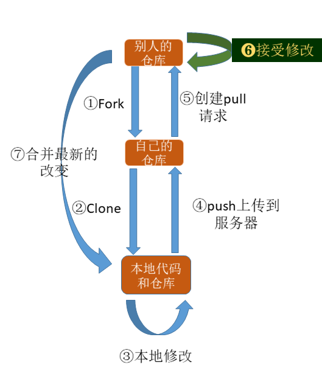
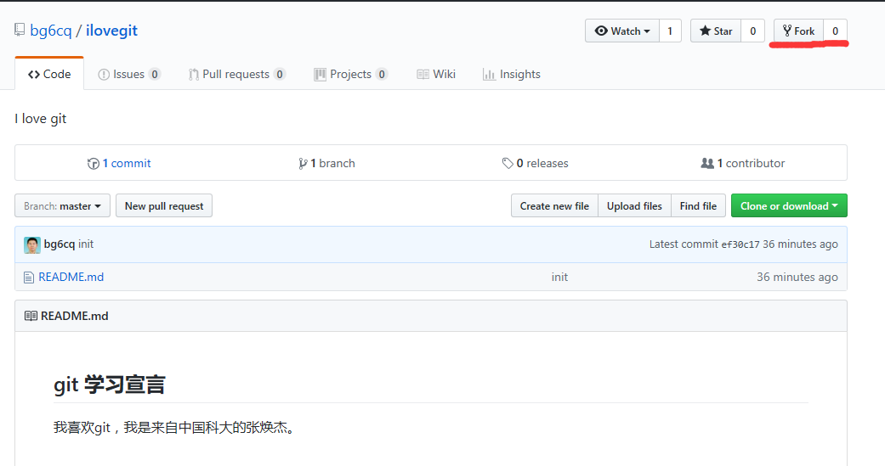
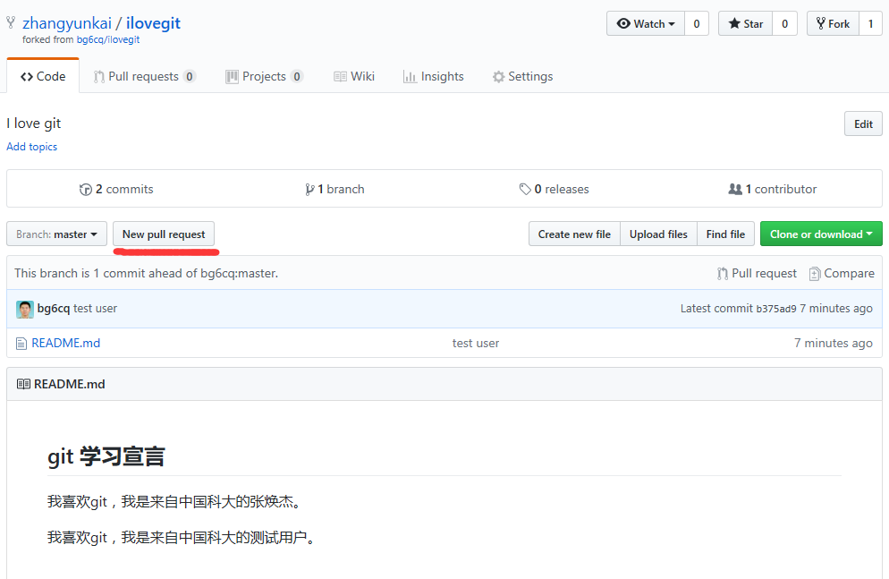
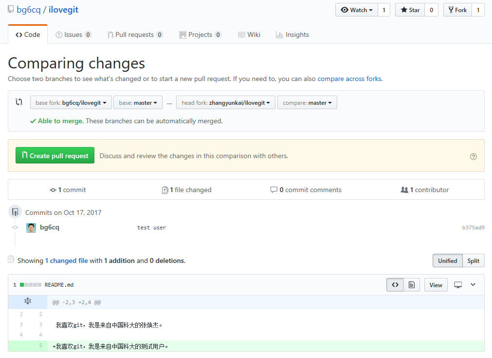
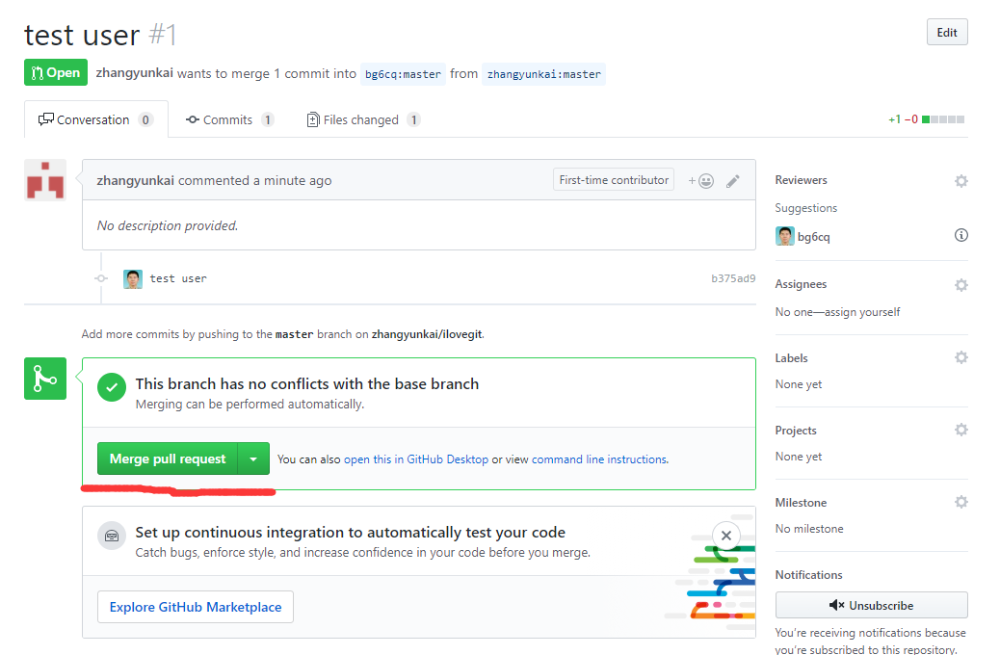
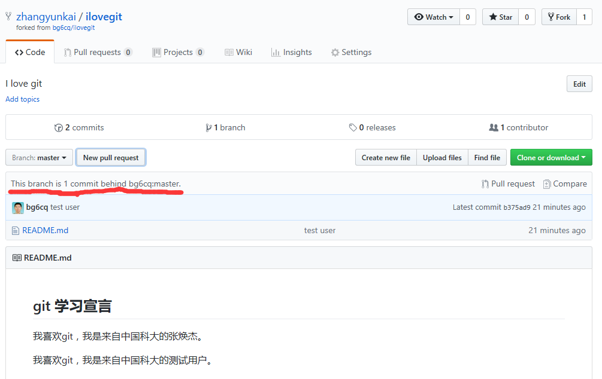
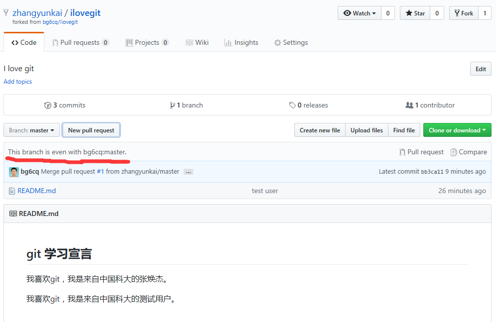

## 第四课 Fork 一个项目，提交修改并发起 Pull Request

> 📌 **提示**：以下示例中的 `YOUR_USERNAME` 请替换为你的 GitHub 用户名。



### 1. 登录 GitHub

访问 [https://github.com](https://github.com) 并登录。

### 2. Fork 一个项目

**Fork** 是将别人的项目拷贝一份到自己的账户下，然后可以自由修改。

本教程的练习项目：**[https://github.com/bg6cq/ilovegit](https://github.com/bg6cq/ilovegit)**

**Fork 步骤**：
1. 访问 [https://github.com/bg6cq/ilovegit](https://github.com/bg6cq/ilovegit)
2. 点击右上角的 **Fork** 按钮
3. 等待片刻，项目会拷贝到你的账户下（`YOUR_USERNAME/ilovegit`）



### 3. 克隆项目到本地

```bash
$ cd ~
$ git clone git@github.com:YOUR_USERNAME/ilovegit.git
Cloning into 'ilovegit'...
remote: Counting objects: 3, done.
remote: Compressing objects: 100% (2/2), done.
remote: Total 3 (delta 0), reused 3 (delta 0), pack-reused 0
Receiving objects: 100% (3/3), done.

$ cd ilovegit/
$ cat README.md
## git 学习宣言

我喜欢 git，我是来自中国科大的张焕杰。
```

> ⚠️ **注意**：克隆的是**你 fork 的项目**（`YOUR_USERNAME/ilovegit`），不是原作者的（`bg6cq/ilovegit`）。

### 4. 修改文件并提交

建议使用 `vi` 或你喜欢的编辑器修改 `README.md`：

```bash
# 编辑文件
$ vi README.md

# 或在文件末尾添加一行
$ echo "我喜欢 git，我是来自中国科大的测试用户。" >> README.md

# 查看修改
$ git diff
diff --git a/README.md b/README.md
index 5ec1b16..04d08a6 100644
--- a/README.md
+++ b/README.md
@@ -1,3 +1,4 @@
 ## git 学习宣言
 
-我喜欢 git，我是来自中国科大的张焕杰。
+我喜欢 git，我是来自中国科大的测试用户。

# 提交
$ git add README.md
$ git commit -m "添加我的学习宣言 - YOUR_NAME"

# 推送到你的 GitHub 仓库
$ git push
Enumerating objects: 5, done.
Counting objects: 100% (5/5), done.
Delta compression using up to 8 threads.
Compressing objects: 100% (2/2), done.
Writing objects: 100% (3/3), 338 bytes | 338.00 KiB/s, done.
Total 3 (delta 0), reused 0 (delta 0), pack-reused 0
To github.com:YOUR_USERNAME/ilovegit.git
   ef30c17..b375ad9  master -> master
```

**验证**：
- ✅ 访问 `https://github.com/YOUR_USERNAME/ilovegit` 能看到变化
- ❌ 访问 `https://github.com/bg6cq/ilovegit` 没有变化

### 5. 发起 Pull Request

Pull Request（PR）是请求原作者合并你的修改。

**步骤**：
1. 访问你的项目 `https://github.com/YOUR_USERNAME/ilovegit`
2. 点击 **Contribute** → **Open pull request**
3. 页面会自动跳转到上游仓库（`bg6cq/ilovegit`），确认修改内容
4. 填写 PR 标题和描述（说明你做了什么修改）
5. 点击 **Create pull request**





> 💡 **提示**：
> - 确保 "Able to merge" 显示无冲突
> - 如有冲突，需先同步上游代码（见第 8 步）

### 6. 等待上游接受（原作者操作）

原作者会看到你的 PR，点击 **Merge pull request** 即可接受修改。



### 7. 查看合并结果

PR 被接受后，访问 `https://github.com/bg6cq/ilovegit` 可以看到你的修改已合并到上游项目。

### 8. 同步上游的修改

Fork 后，上游的修改不会自动同步，需要手动合并。

**添加上游仓库**（只需一次）：
```bash
$ git remote add upstream https://github.com/bg6cq/ilovegit.git
```

**检查远程仓库**：
```bash
$ git remote -v
origin    git@github.com:YOUR_USERNAME/ilovegit.git (fetch)
origin    git@github.com:YOUR_USERNAME/ilovegit.git (push)
upstream  https://github.com/bg6cq/ilovegit.git (fetch)
upstream  https://github.com/bg6cq/ilovegit.git (push)
```

**同步上游代码**：
```bash
# 获取上游最新代码
$ git fetch upstream

# 合并到本地 master 分支
$ git checkout master
$ git merge upstream/master

# 或直接使用 pull
$ git pull upstream master

# 推送到你的 GitHub 仓库
$ git push
```

如果有新提交，GitHub 会提示：



同步后：



### 9. 与其他人协作

Git 的协作是网状的，可以合并多个来源的代码。

**添加其他协作者的仓库**：
```bash
$ git remote add OTHER_USER https://github.com/OTHER_USER/ilovegit.git
$ git pull OTHER_USER master
```

---

## ✅ 课程完成检查点

- [ ] Fork 一个项目
- [ ] 在本地下载代码并修改、提交
- [ ] GitHub 上能看到提交历史
- [ ] 创建 Pull Request
- [ ] 等待 PR 合并后，同步上游代码

> 🎉 **恭喜**！完成第四课后，你已经理解了 GitHub 协作的核心流程！

---

> 📌 **下一步**：完成 [第五课 交流与沟通](../5/README.md)
