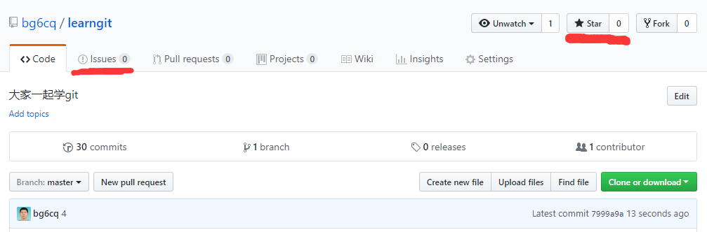

## 第五课 与其他人交流/沟通

Git 是版本管理工具，GitHub 则提供了完整的协作和社交功能。

### 1. 为项目加星 ⭐

点击项目页面右上角的 **Star** 按钮，表示你喜欢这个项目。

> 💡 **提示**：
> - Star 类似"点赞"，可以收藏感兴趣的项目
> - 在 GitHub Profile 中可以看到你 Star 的项目
> - 项目 Star 数是受欢迎程度的指标

### 2. 关注项目 👀

点击 **Watch** 可以选择接收项目的通知：
- **Not watching**：不接收通知
- **Releases only**：仅接收新版本发布通知
- **All Activity**：接收所有动态（新 Issue、PR、评论等）

### 3. 使用 Issues 交流

Issues 是 GitHub 的讨论系统，用于：
- 🐛 报告 Bug
- 💡 提出新功能建议
- ❓ 提问和讨论

**科大学生 Linux 用户协会的讨论区**：
[https://github.com/ustclug/discussions/issues](https://github.com/ustclug/discussions/issues)

**本教程的 Issues**：
[https://github.com/bg6cq/learngit/issues](https://github.com/bg6cq/learngit/issues)

欢迎在本教程项目中留言交流！

### 4. 参与讨论

**创建新 Issue**：
1. 进入项目的 **Issues** 标签
2. 点击 **New issue**
3. 填写标题和内容
4. 可以选择标签（Label）、指派给某人（Assignees）等

**回复 Issue**：
- 在现有 Issue 中评论
- 支持 Markdown 格式
- 可以 @提及其他用户

### 5. 其他社交功能

- **Projects**：项目管理看板（类似 Trello）
- **Discussions**：论坛式讨论（不同于 Issues）
- **Sponsors**：资助开源项目

---

## ✅ 课程完成检查点

- [ ] 在 GitHub 上找到感兴趣的项目并 Star
- [ ] 在本教程的 Issues 中留言或提问
- [ ] （可选）尝试创建一个 Issue

---

> 📌 **下一步**：完成 [第六课 分支管理](../6/README.md)
