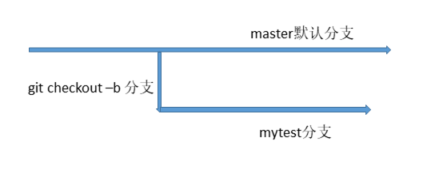
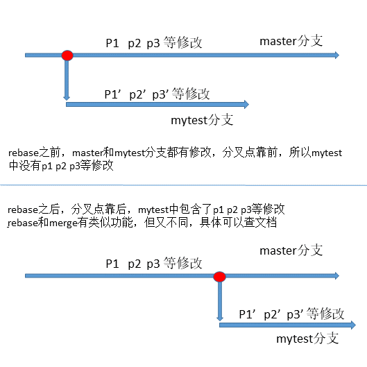

## 第六课 创建分支、分支合并与变基操作

Git 的核心优势之一是轻量级分支管理。



### 1. 创建分支

在第四课的项目目录下进行：

```bash
# 进入项目目录
$ cd ~/ilovegit/

# 同步上游最新代码
$ git pull upstream master
From https://github.com/bg6cq/ilovegit
 * branch            master     -> FETCH_HEAD
Already up-to-date.

# 创建并切换到新分支 mytest
$ git checkout -b mytest
Switched to a new branch 'mytest'

# 查看当前分支
$ git branch
  master
* mytest
```

`* mytest` 表示当前处于 `mytest` 分支。

### 2. 在分支上开发

```bash
# 修改文件
$ echo "这是分支 mytest 的修改" >> README.md

# 查看差异
$ git diff
diff --git a/README.md b/README.md
index 5ec1b16..04d08a6 100644
--- a/README.md
+++ b/README.md
@@ -5,3 +5,4 @@
 我喜欢 git，我是来自中国科大的测试用户。

 我喜欢 git，我是来自四川托普职院的用户。
+这是分支 mytest 的修改

# 查看状态
$ git status
# On branch mytest
# Changes not staged for commit:
#   (use "git add <file>..." to update what will be committed)
#   (use "git restore <file>..." to discard changes in working directory)
#
#       modified:   README.md
#
no changes added to commit (use "git add" and/or "git commit -a")

# 提交
$ git add README.md
$ git commit -m "mytest branch test"
[mytest 706b7ca] mytest branch test
 1 file changed, 1 insertion(+)

# 推送分支到远程
$ git push origin mytest
Enumerating objects: 12, done.
Counting objects: 100% (12/12), done.
Delta compression using up to 8 threads.
Compressing objects: 100% (7/7), done.
Writing objects: 100% (10/10), 1.01 KiB, done.
Total 10 (delta 3), reused 0 (delta 0), pack-reused 0
remote: Resolving deltas: 100% (3/3), completed with 1 local object.
To github.com:YOUR_USERNAME/ilovegit.git
 * [new branch]      mytest -> mytest
```

**验证**：访问 `https://github.com/YOUR_USERNAME/ilovegit/branches` 可以看到 `mytest` 分支。

### 3. 分支合并

分支开发完成后，可以合并到主分支。

```bash
# 切换回 master 分支
$ git checkout master
Switched to branch 'master'

# 合并 mytest 分支
$ git merge mytest
Updating 983962c..2170f78
Fast-forward
 README.md | 2 +-
 1 file changed, 1 insertion(+), 1 deletion(-)

# 推送到远程
$ git push origin master
```

> 💡 **Fast-forward 合并**：如果 master 没有新提交，Git 会直接移动指针（快进模式）。

### 4. 分支变基（Rebase）

**Rebase** 是将分支的修改"重新应用"到目标分支的最新提交上。

#### 场景演示

假设 master 分支有了新提交：

```bash
# 在 master 上修改
$ git checkout master
$ echo "我喜欢 git，我是来自火星的用户。" >> README.md
$ git add README.md
$ git commit -m "change in master"
[master a88b59e] change in master
 1 file changed, 2 insertions(+)

# 切换到 mytest 分支并修改
$ git checkout mytest
$ echo "我喜欢 git，我是来自 CERNET 的用户。" >> README.md
$ git add README.md
$ git commit -m "change in mytest"
[mytest 762c5aa] change in mytest
 1 file changed, 2 insertions(+)
```

#### 执行 Rebase

```bash
$ git rebase master
First, rewinding head to replay your work on top of it...
Applying: change in mytest
Using index info to reconstruct a base tree...
M       README.md
Falling back to patching base and 3-way merge...
Auto-merging README.md
CONFLICT (content): Merge conflict in README.md
Failed to merge in the changes.
Patch failed at 0001 change in mytest
The copy of the patch that failed is found in:
   .git/rebase-apply/patch

When you have resolved this problem, run "git rebase --continue".
If you prefer to skip this patch, run "git rebase --skip" instead.
To check out the original branch and stop rebasing, run "git rebase --abort".
```

#### 解决冲突

1. 编辑 `README.md`，找到冲突标记：
```
<<<<<<< HEAD
=======
>>>>>>> change in mytest
```

2. 手动修改，保留需要的内容，删除冲突标记

3. 标记为解决并继续：
```bash
$ git add README.md
$ git rebase --continue
```

4. 完成后推送到远程：
```bash
$ git push origin mytest
```

### 5. 查看分支网络图

访问 `https://github.com/YOUR_USERNAME/ilovegit` → **Insights** → **Network** 可以看到分支的有向图。



### 6. 删除分支

**删除本地分支**（合并后不再需要）：
```bash
$ git branch -D mytest
```

**删除远程分支**：
```bash
$ git push origin --delete mytest
# 或旧语法
$ git push origin :mytest
```

也可以在 GitHub 网页界面删除分支。

---

## 📌 最佳实践

| 场景 | 推荐操作 |
|------|----------|
| 开发新功能 | 创建功能分支 `feature/xxx` |
| 修复 Bug | 创建修复分支 `fix/xxx` |
| 合并到主分支 | 使用 Pull Request 代码审查 |
| 同步上游代码 | `git pull upstream master` |
| 整理提交历史 | 合并前使用 `git rebase -i` |

---

## ✅ 课程完成检查点

- [ ] 创建分支，并在分支上提交修改
- [ ] 将分支推送到 GitHub
- [ ] 在 GitHub 上查看分支网络图
- [ ] 合并分支到 master
- [ ] （可选）尝试 rebase 和解决冲突

---

> 📌 **下一步**：完成 [第七课 整理提交历史](../7/README.md)
