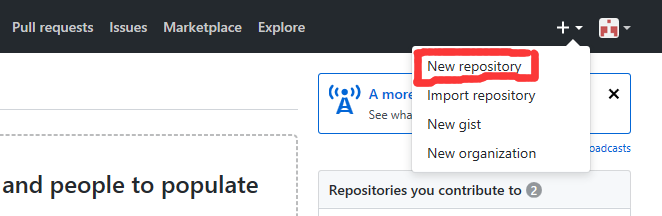
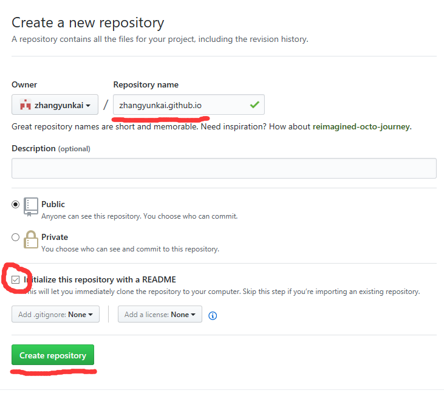
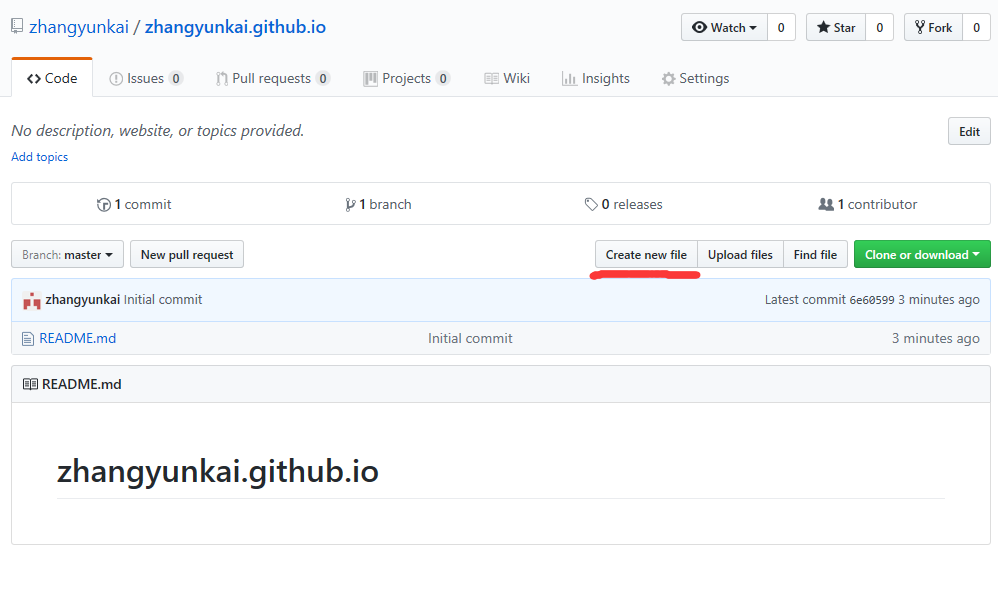
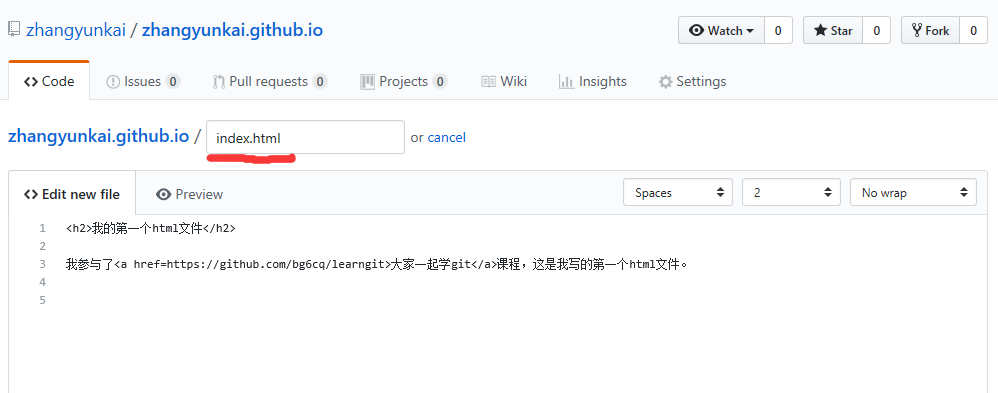

## 第八课 使用 GitHub Pages 建立自己的主页

GitHub Pages 是免费的静态网站托管服务，完全由你控制（无广告、无空间限制），可绑定自定义域名。

### 1. 登录 GitHub

访问 [https://github.com](https://github.com) 并登录。

### 2. 创建项目

1. 点击右上角 **+** → **New repository**
2. 填写信息：
   - **Repository name**：`YOUR_USERNAME.github.io`（**必须是这个格式**）
     - 例如：用户名是 `zhangsan`，仓库名必须是 `zhangsan.github.io`
   - **Public**：必须公开
   - ✅ 勾选 **Initialize this repository with a README**
3. 点击 **Create repository**




### 3. 添加 index.html

#### 方法 A：GitHub 网页编辑（推荐新手）

1. 点击 **Create new file**
2. 文件名输入 `index.html`
3. 内容输入：

```html
<!DOCTYPE html>
<html lang="zh-CN">
<head>
    <meta charset="UTF-8">
    <meta name="viewport" content="width=device-width, initial-scale=1.0">
    <title>我的个人主页</title>
    <style>
        body { font-family: Arial, sans-serif; max-width: 800px; margin: 50px auto; padding: 20px; }
        h1 { color: #0366d6; }
        a { color: #0366d6; }
    </style>
</head>
<body>
    <h1>👋 你好，我是 YOUR_NAME</h1>
    <p>这是我用 GitHub Pages 搭建的个人主页。</p>
    <p>我参与了 <a href="https://github.com/bg6cq/learngit">大家一起学 Git</a> 课程。</p>
    
    <h2>关于我</h2>
    <ul>
        <li>学校/公司：XXX</li>
        <li>邮箱：your_email@example.com</li>
        <li>GitHub: <a href="https://github.com/YOUR_USERNAME">@YOUR_USERNAME</a></li>
    </ul>
</body>
</html>
```

4. 点击底部 **Commit new file**




#### 方法 B：本地编辑后推送

```bash
# 克隆仓库
$ git clone git@github.com:YOUR_USERNAME/YOUR_USERNAME.github.io.git
$ cd YOUR_USERNAME.github.io

# 创建 index.html
$ vi index.html
# （粘贴上面的 HTML 内容并修改）

# 提交并推送
$ git add index.html
$ git commit -m "Add personal homepage"
$ git push
```

### 4. 访问你的主页

访问 `https://YOUR_USERNAME.github.io`（替换为你的用户名）

例如：
- 用户名 `zhangsan` → `https://zhangsan.github.io`
- 用户名 `bg6cq` → `https://bg6cq.github.io`

### 5. 使用 Jekyll 主题（可选）

GitHub Pages 支持 Jekyll 静态博客生成器。

**快速启用主题**：
1. 访问仓库的 **Settings** → **Pages**
2. 在 **Theme chooser** 中选择喜欢的主题
3. 修改 `_config.yml` 配置个人信息

### 6. 绑定自定义域名（可选）

**步骤**：
1. 在仓库根目录创建 `CNAME` 文件，内容是你的域名：
```
example.com
```

2. 在你的域名 DNS 设置中添加：
   - **A 记录**：`@` → `185.199.108.153`（GitHub Pages IP）
   - 或 **CNAME 记录**：`www` → `YOUR_USERNAME.github.io`

3. 在仓库 **Settings** → **Pages** → **Custom domain** 中填写域名

详细教程请搜索 "GitHub Pages custom domain"。

---

## 📌 进阶用法

- 使用 [Jekyll](https://jekyllrb.com/) 搭建博客
- 使用 [Hugo](https://gohugo.io/) 快速生成静态站
- 集成 [GitHub Actions](https://github.com/features/actions) 自动部署
- 添加 [Google Analytics](https://analytics.google.com/) 统计访问

---

## ✅ 课程完成检查点

- [ ] 创建 `YOUR_USERNAME.github.io` 仓库
- [ ] 添加 `index.html` 文件
- [ ] 成功访问 `https://YOUR_USERNAME.github.io`
- [ ] （可选）绑定自定义域名

---

## 🎉 恭喜完成课程！

你已经完成了 Git 和 GitHub 的入门学习！

### 接下来可以：

1. **实践**：在日常项目中使用 Git 管理代码
2. **参与开源**：Fork 感兴趣的项目，提交 PR
3. **深入学习**：
   - [Git 官方文档](https://git-scm.com/doc)
   - [猴子都能懂的 GIT 入门](https://backlog.com/git-tutorial/cn/)
   - [GitHub Skills](https://skills.github.com/)
4. **分享**：将本教程推荐给朋友

---

> 💡 **反馈**：欢迎在 [Issues](https://github.com/bg6cq/learngit/issues) 中提出建议或问题！
